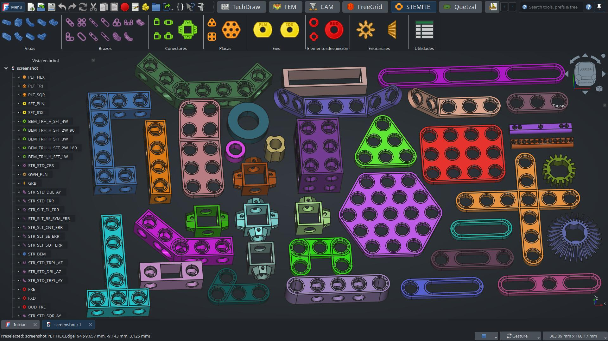

# STEMFIE Workbench

[![Contributions welcome][ContribsW_badge]][CONTRIBUTING]
[![license][license_badge]][LICENSE]
[![FreeCAD Addon Manager][AddonMgr_badge]][AddonMgr]
[![pre-commit enabled][pre-commit_badge]][pre-commit]
[![Code style: black][black_badge]][black]
[![GitHub Tag][tag_bagde]][tag]
[![Common Changelog][cc_badge]][CHANGELOG]

This [FreeCAD][FreeCAD] workbench offers a *subset* of the [STEMFIE][STEMFIE] 3D-printable
construction set. The [Code-CAD] paradigm is implemented to generate parametric objects that
can scale easily. We use FreeCAD's [Part Workbench] to generate all the shapes.

> [!NOTE]
> Most parts are an exact match to official STEMFIE parts but some can have very minor shape
> variations, including the `Code` property that identifies the part.

> [!TIP]
> Some parts, as braces & plates, have a property called `SimpleShape` that lets you switch to a
> minimalistic version of the shape which is better suited to be used to fabricate the parts using a
> laser cutting machine instead of 3D-printer reducing time and cost.

> [!IMPORTANT]
> To generate STEMFIE gears we rely on the [Gear WB], its installation is advised!



## Installation

### Automatic Installation

The recommended way to install STEMFIE is via FreeCAD's [Addon Manager] under
`Tools > Addon Manager` drop-down menu.

Search for **STEMFIE** on the workbench category.

### Manual installation

The install path for FreeCAD modules depends on the operating system used.

To find where is the user's application data directory enter next command on
FreeCAD's Python console.

```python
App.getUserAppDataDir()
```

Examples on different OS

- Linux: `/home/user/.local/share/FreeCAD/Mod/`
- macOS: `/Users/user/Library/Preferences/FreeCAD/Mod/`
- Windows: `C:\Users\user\AppData\Roaming\FreeCAD\Mod\`

Use the CLI to enter the `Mod` directory and use Git to install STEMFIE:

```shell
git clone https://github.com/bilbaomakers/StemfieWB STEMFIE
```

If you are updating the code, restarting FreeCAD is advised.

## Changelog

Read our [CHANGELOG] file to know about the latest changes.

## Contributing

Read our [CONTRIBUTING] file to know about ways how to help on the workbench.

## Links

- About STEMFIE: <https://www.stemfie.org/about>
- Workbench documentation: <https://wiki.freecad.org/Stemfie_Workbench>
- FreeCAD's forum thread: <https://forum.freecad.org/viewtopic.php?t=59951>

[CONTRIBUTING]: ./CONTRIBUTING.md
[ContribsW_badge]: <https://img.shields.io/badge/contributions-welcome-brightgreen.svg?style=flat>
[LICENSE]: ./LICENSE
[license_badge]: <https://img.shields.io/github/license/bilbaomakers/StemfieWB>
[AddonMgr]: <https://github.com/FreeCAD/FreeCAD-addons>
[AddonMgr_badge]: <https://img.shields.io/badge/FreeCAD%20addon%20manager-available-brightgreen>
[pre-commit]: <https://github.com/pre-commit/pre-commit>
[pre-commit_badge]: <https://img.shields.io/badge/pre--commit-enabled-brightgreen?logo=pre-commit>
[black]: <https://github.com/psf/black>
[black_badge]: <https://img.shields.io/badge/code%20style-black-000000.svg>
[tag]: <https://github.com/bilbaomakers/StemfieWB/releases>
[tag_bagde]: <https://img.shields.io/github/v/tag/bilbaomakers/StemfieWB>
[cc_badge]: <https://common-changelog.org/badge.svg>
[CHANGELOG]: ./CHANGELOG.md
[FreeCAD]: <https://freecad.org> "FreeCAD"
[STEMFIE]: <https://stemfie.org/> "STEMFIE"
[Code-CAD]: <https://learn.cadhub.xyz/blog/curated-code-cad/>
[Part Workbench]: <https://wiki.freecad.org/Part_Workbench>
[Gear WB]: <https://github.com/looooo/freecad.gears>
[Addon Manager]: <https://wiki.freecad.org/Std_AddonMgr>
